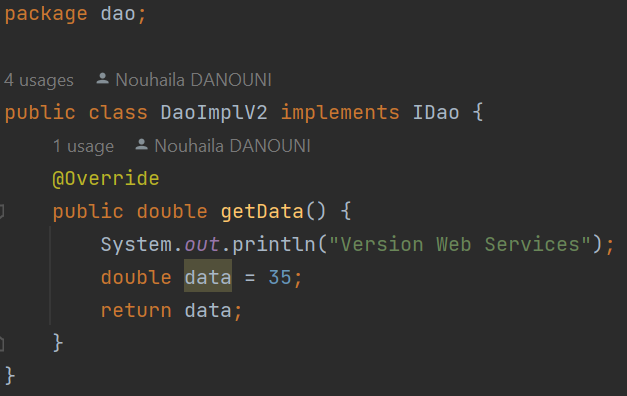

Realisée par : DANOUNI NOUHAILA

_________________________________________________________________________________________________
<h1>Rapport de TP N°1 : Invertion de Contrôle et Injection des dépendances</h1>
<h2 style="color: olivedrab">Introduction</h2>

Ce rapport explore les concepts d'Inversion de Contrôle (IoC) et d'Injection des Dépendances (DI) dans le contexte du développement logiciel. IoC et DI sont des principes fondamentaux visant à améliorer la modularité, la testabilité et la maintenabilité des applications. Dans cette étude, nous examinerons leurs avantages, principes de base, et leur mise en œuvre pratique à travers des exemples concrets. Ce rapport sert de guide pour comprendre et appliquer efficacement IoC et DI dans le développement de logiciels robustes et évolutifs.

<h2 style="color: olivedrab">Ennoncé</h2>
<ol>
    <li>Couche DAO 
        <ul>
            <li>Créer l'interface IDao</li>
            <li>Créer une implémentation de l'interface IDao</li>
        </ul>
    </li>
    <li>Couche Métier
        <ul>
            <li>Créer l'interface IMetier</li>
            <li>Créer une implémentation de l'interface IMetier</li>
        </ul>
    </li>
    <li>Couche Présentation
        
Créer une application qui permet de faire l'injection des dépandences

        <ul>
        <li>Instantiation statique</li>
        <li>Instantiation dynamique</li>
        <li>En utilisant Spring Framework
            <ul>
                <li>version XML</li>
                <li>version Annotation</li>
            </ul>
        </li>
        </ul>
    </li>
</ol>
<h2 style="color: olivedrab">Conception</h2>
<h3>Principe du couplage faible</h3>

L'utilisation d'interfaces est essentielle pour réduire le couplage entre les classes. Par exemple, lorsque MetierImpl est liée à l'interface IDao, un couplage faible est établi. Cela signifie que MetierImpl peut collaborer avec n'importe quelle classe respectant le contrat de IDao, sans nécessiter de modifications dans MetierImpl. Cette approche favorise la flexibilité et la résistance aux modifications internes, créant ainsi des applications robustes et extensibles.

Lorsque nous adoptons un couplage faible, nous favorisons la création d'applications qui sont "fermées à la modification" (nous n'avons pas besoin de modifier les classes existantes) et "ouvertes à l'extension" (nous pouvons ajouter de nouvelles classes qui implémentent l'interface sans perturber le fonctionnement des classes existantes).

<h2 style="color: olivedrab">Captures d'écrans</h2>
<h3>Création de l'interface IDao</h3>

<h3>Création d'une implémentation de l'interface IDao version Base de Données</h3>

<h3>Création d'une implémentation de l'interface IDao version web services</h3>

<h3>Création de l'interface IMetier</h3>

<h3>Création d'une implémentation de l'interface IMetier</h3>

<h3>Instantiation statique</h3>

<h3>Instantiation dynamique</h3>

L'ajout d'un fichier "config.txt" :

<h3>Injection des dépendances en utilisant Spring version xml</h3>

<h3>Injection des dépendances en utilisant Spring version annotations</h3>

Repository Class

@Repository : Cette annotation est utilisée pour indiquer que la classe est un composant de persistance, généralement utilisé pour les accès aux données.

Service Class

@Service : Cette annotation est utilisée pour marquer une classe en tant que service. Les classes de service contiennent la logique métier de l'application. Les classes annotées avec @Service sont découvertes et gérées par Spring.

Controller

@Controller : Cette annotation est utilisée pour marquer une classe en tant que contrôleur dans le contexte Spring MVC.

<h2 style="color: olivedrab">Conclusion</h2>

En conclusion, ce rapport a exploré les principes cruciaux de l'Inversion de Contrôle (IoC) et de l'Injection des Dépendances (DI) dans le contexte du développement logiciel. Ces concepts ont été étudiés en détail, mettant en évidence leur impact sur la modularité, la testabilité et la maintenabilité des applications. La mise en œuvre pratique, tant à travers l'utilisation d'interfaces pour réduire le couplage que via l'intégration de Spring Framework en utilisant des configurations XML et des annotations, a été démontrée. Comprendre et appliquer ces concepts est essentiel pour concevoir des applications flexibles, résistantes aux changements internes, et prêtes à s'étendre, offrant ainsi un cadre solide pour le développement logiciel moderne.

