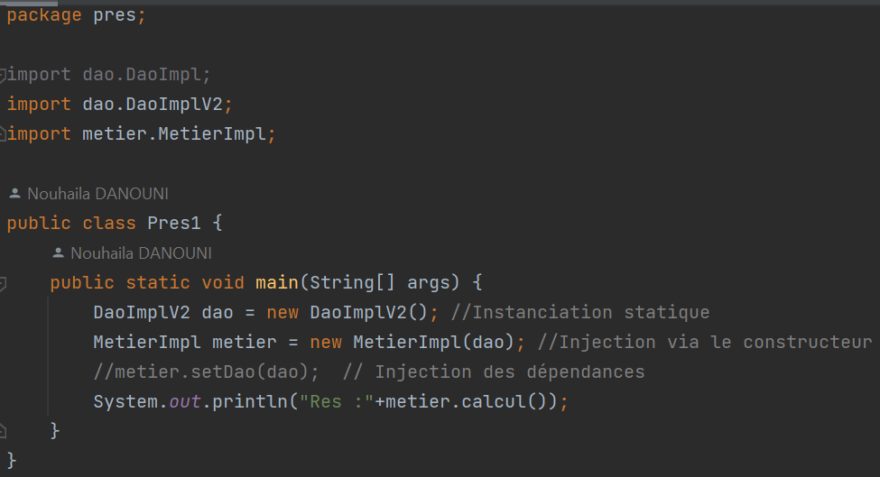
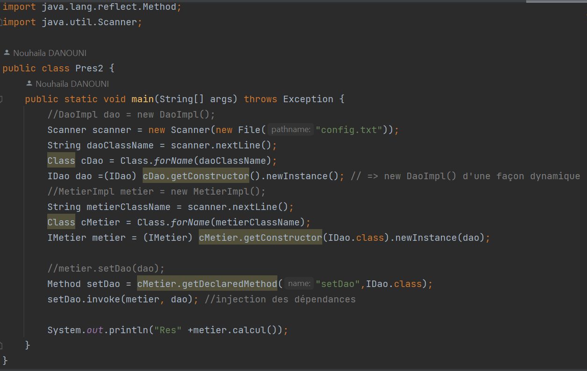

Realisée par : DANOUNI NOUHAILA

_____________________________________________________________
<h1>Rapport de TP N°1 : Invertion de Contrôle et Injection des dépendances</h1>
<h2 style="color: olivedrab">Introduction</h2>

Ce rapport explore les concepts d'Inversion de Contrôle (IoC) et d'Injection des Dépendances (DI) dans le contexte du développement logiciel. IoC et DI sont des principes fondamentaux visant à améliorer la modularité, la testabilité et la maintenabilité des applications. Dans cette étude, nous examinerons leurs avantages, principes de base, et leur mise en œuvre pratique à travers des exemples concrets. Ce rapport sert de guide pour comprendre et appliquer efficacement IoC et DI dans le développement de logiciels robustes et évolutifs.

<h2 style="color: olivedrab">Ennoncé</h2>
<ol>
    <li>Couche DAO 
        <ul>
            <li>Créer l'interface IDao</li>
            <li>Créer une implémentation de l'interface IDao</li>
        </ul>
    </li>
    <li>Couche Métier
        <ul>
            <li>Créer l'interface IMetier</li>
            <li>Créer une implémentation de l'interface IMetier</li>
        </ul>
    </li>
    <li>Couche Présentation
        
Créer une application qui permet de faire l'injection des dépandences

        <ul>
        <li>Instantiation statique</li>
        <li>Instantiation dynamique</li>
        <li>En utilisant Spring Framework
            <ul>
                <li>version XML</li>
                <li>version Annotation</li>
            </ul>
        </li>
        </ul>
    </li>
</ol>
<h2 style="color: olivedrab">Conception</h2>
<h3>Principe du couplage faible</h3>

L'utilisation d'interfaces est essentielle pour réduire le couplage entre les classes. Par exemple, lorsque MetierImpl est liée à l'interface IDao, un couplage faible est établi. Cela signifie que MetierImpl peut collaborer avec n'importe quelle classe respectant le contrat de IDao, sans nécessiter de modifications dans MetierImpl. Cette approche favorise la flexibilité et la résistance aux modifications internes, créant ainsi des applications robustes et extensibles.

<h2 style="color: olivedrab">Captures d'écrans</h2>
<h3>Création de l'interface IDao</h3>

<h3>Création d'une implémentation de l'interface IDao version Base de Données</h3>

<h3>Création d'une implémentation de l'interface IDao version web services</h3>

<h3>Création de l'interface IMetier</h3>

<h3>Création d'une implémentation de l'interface IMetier</h3>

<h3>Instantiation statique</h3>

<h3>Instantiation dynamique</h3>

<h3>Injection des dépendances en utilisant Spring version xml</h3>

On doit installer en premier lieu les dépandences, ensuite ajouter un fichier config.xml

<h3>Injection des dépendances en utilisant Spring version annotations</h3>

Repository Class

Service Class

Controller

